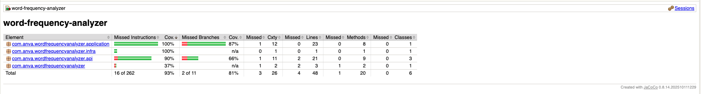

# Word Frequency Analyzer

This is a lightweight Spring Boot application that analyzes the frequency
of words in a given text which contains words separated by non-characters.
Following assumptions are considered:

- **Word**: A word represents a sequence of 1 or more characters (a-z A-Z). For
  example: kjsHKDieh or Insurance;
- **Input Text**: The input text contains words which are separated by different types of
  separation characters. Added assumption that any non-char (not a-z A-Z) is considered a
  separation. This is configurable property in [application.properties](./src/main/resources/application.properties "Test coverage")
- **Available memory**: There is sufficient memory available to store the entire
  entered text;
- **Capitalization**: For this case, there is no distinction made between uppercase and
  lowercase letters. For example: the sentence "The car is the color purple." will
  indicate that "the" occurs 2 times.

### Use case
Three methods defined in the below interfaces are exposed via REST API:
- **calculateHighestFrequency** returns the highest frequency in the text (multiple
words may have this frequency);
  - **API**: `POST /frequency/highest` with text in request payload
- **calculateFrequencyForWord** returns the frequency for the specified word in the
specified text;
  - **API**: `POST /frequency/by-word/{word}` with text in request payload
- **calculateMostFrequentNWords** returns a list of the “n” most frequent words in
the specified text, with all words returned in lowercase. If multiple words have the
same frequency, they are returned in alphabetical order. As an example: the text "The cat walks over the staircase" with n = 3 will return the
following list: {("the", 2), ("cat", 1), ("walks", 1)}
  - **API**: `POST /frequency/by-limit/{limit}` with text in request payload

## Running the application

### Prerequisite 
- Java 25
- Gradle
- Optional rest Client for local testing. [Postman](https://postman.com). Sample requests [postman_collection.json](./postman_collection.json) can be used.

To run the application, you can use the following command:

```bash
./gradlew bootRun
```

This will build all the necessary packages needed and start the application at `http://localhost:8080`.

## Running the tests

To run the tests, you can use the following command:

```bash
./gradlew test
```

To run the test coverage, you can use the following command:

```bash
./gradlew test jacocoTestReport
```
Report should be available at: `./build/reports/jacoco/test/html/index.html`
Should look like this: 

***
# Local Testing
**Sample postman coverage for testing**
[postman_collection.json](./postman_collection.json)

**If you prefer http requests**
[requests.http](./requests.http)
***

## Project Structure

The project is structured as follows:

- `src/main/java`: Contains the main source code of the application.
    - `api`: Contains the REST controllers.
    - `application`: Contains the application services.
    - `domain`: Contains the domain objects.
- `src/test/java`: Contains the test source code.
- `src/itest/java`: Contains the integration test source code.
